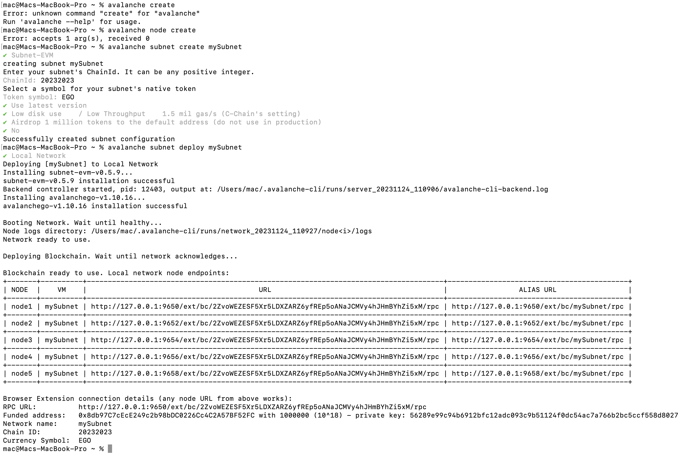
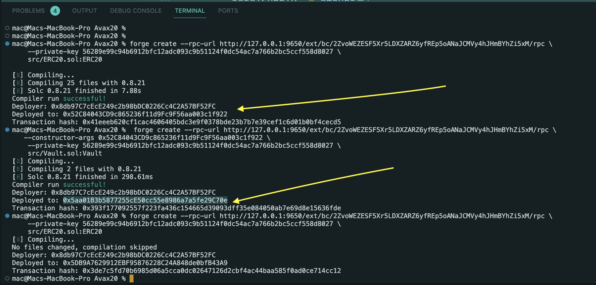

# ERC20 and Vault Smart contrct


This smart contract allows players to collect, build, and earn rewards for their participation in the game's activities.

It has two main contracts, ERC20 token contract and the Vault contract

The ERC20-Token contract, src/ERC20.sol, was deployed on the marsSubnet network at the contract address: 0x52C84043CD9c865236f11d9Fc9F56aa003c1f922 and

The Vault contract, src/Vault.sol was deployed on the marsSubnet network at the contract address: 0x5aa01B3b5877255cE50cc55e8986a7a5fe29C70e.

# Contract Details


RPC URL:          http://127.0.0.1:9650/ext/bc/2ZvoWEZESF5Xr5LDXZARZ6yfREp5oANaJCMVy4hJHmBYhZi5xM/rpc

Funded address:   0x8db97C7cEcE249c2b98bDC0226Cc4C2A57BF52FC with 1000000 (10^18) - 
private key: 56289e99c94b6912bfc12adc093c9b51124f0dc54ac7a766b2bc5ccf558d8027

Network name:     mySubnet

Chain ID:         20232023

Currency Symbol:  EGO

# Vault Contract Functionalities

## Deposit

- The deposit() function allows users to deposit ERC-20 tokens into the vault.

- This function calculates the number of shares to mint based on the deposited amount and the current total supply of shares.

```dotnetcli

function deposit(uint _amount) external {
        uint shares;
        if (totalSupply == 0) {
            shares = _amount;
        } else {
            shares = (_amount * totalSupply) / token.balanceOf(address(this));
        }

        _mint(msg.sender, shares);
        token.transferFrom(msg.sender, address(this), _amount);
    }

```
## Withdraw

- The withdraw function allows users to withdraw their tokens from the vault.

- This function calculates the amount to withdraw based on the number of shares burned and the current total supply of shares.

```dotnetcli

function withdraw(uint _shares) external {
        uint amount = (_shares * token.balanceOf(address(this))) / totalSupply;
        _burn(msg.sender, _shares);
        token.transfer(msg.sender, amount);
    }
```

## ERC-20 Interface

The ERC20 interface provides the functions signatures basic token operations like checking balances, transferring tokens, and approving token transfers.

```
interface IERC20 {
    function totalSupply() external view returns (uint);

    function balanceOf(address account) external view returns (uint);

    function transfer(address recipient, uint amount) external returns (bool);

    function allowance(
        address owner,
        address spender
    ) external view returns (uint);

    function approve(address spender, uint amount) external returns (bool);

    function transferFrom(
        address sender,
        address recipient,
        uint amount
    ) external returns (bool);

    event Transfer(address indexed from, address indexed to, uint value);
    event Approval(address indexed owner, address indexed spender, uint value);
}
```
# Step by Step Guild


Token Approval: Before depositing, ensure that you have approved the contract to spend your ERC20 tokens. Use the ERC20 approve function to grant the necessary permission.

`function approve(address spender, uint amount) external returns (bool);`

 Deposit: Call the deposit function with the desired amount of tokens to mint corresponding shares.

 Withdraw: Call the withdraw function with the number of shares to burn and receive the proportional amount of tokens.

Monitor Balances: Keep track of your token balances and shares to manage deposits and withdrawals effectively, by calling the balanceOf()

    function balanceOf(address account) external view returns (uint);

# Deploying my EVM subnet using the Avalanche CLI



# Deploying the Smart contract using Foundry



# Added Subnet to Metamask and Connected to Injected Provider


## Authors
[@metacraftersio]()

[Oche Esther](https://twitter.com/Estheroche1)

## License

This project is licensed under the MIT License - see the LICENSE.md file for details.
